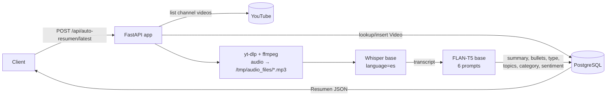

# Mañaneras Backend

> Backend MVP that downloads the audio of a YouTube video, transcribes it to Spanish text and produces an automatic summary and semantic analysis, storing everything in PostgreSQL behind a FastAPI REST API.


---

## Project Overview

`mananeras-backend` is a small, single-service Python backend written in May 2025. It exposes a REST API that can:

1. register YouTube videos in a PostgreSQL database;
2. download a video's audio with `yt-dlp`;
3. transcribe the audio (Spanish) with OpenAI Whisper;
4. run six prompts against the `google/flan-t5-base` text-to-text model to produce a summary, bullet points, a discourse type, main topics, a policy category and a sentiment label;
5. store and serve those results.

A dedicated endpoint looks up the **latest video of a hard-coded YouTube channel** (`@ClaudiaSheinbaumP`) and runs the whole pipeline on it. This, together with the repository name, points to the project's purpose: automatically summarizing the Mexican presidential daily morning press conferences, colloquially called *"las mañaneras"*.

## Project Context

| Item | Value | Evidence level |
|------|-------|----------------|
| Project type | **Personal Project — Proof of Concept / MVP** | Inferred |
| Author | Baruch López | Confirmed (git history) |
| Development period | 22–24 May 2025 | Confirmed (git history) |
| Self-description | "MVP Mañaneras" | Confirmed (`src/main.py`, first commit message) |
| Academic origin | No evidence (no course, university or assignment material exists in the repository) | — |
| Target deployment | Railway (Nixpacks first, then Dockerfile) | Confirmed (commit messages, deleted `railway.toml`) |
| Companion frontend | The `-backend` suffix suggests one, but it is not in this repository | Unknown |

See [`docs/project-context.md`](docs/project-context.md) for the full reconstruction and evidence.

## Problem Statement

The *mañaneras* are long daily press conferences (often a couple of hours) published on YouTube. Following them fully takes a lot of time. The project tries to turn each video into a short, structured and queryable record: a transcript, a summary, key points, topics, a category and a sentiment. *(Inferred from code and naming; no written problem statement exists in the repository.)*

## Objective

To build a minimum viable backend able to take the latest *mañanera* from YouTube and, with a single API call, produce and persist an automatic Spanish transcript plus an AI-generated analysis that a client application could consume.

## Repository Structure

```
mananeras-backend/
├── README.md                  ← you are here
├── AGENTS.md                  ← working rules for contributors and AI coding agents
├── LICENSE                    ← Apache License 2.0 (original)
├── .gitignore                 ← original Python .gitignore
├── src/                       ← ORIGINAL IMPLEMENTATION (unchanged, self-contained deployable unit)
│   ├── main.py                ← FastAPI app and endpoints
│   ├── database.py            ← SQLAlchemy engine/session from DATABASE_URL
│   ├── models.py              ← ORM models: Video, Resumen
│   ├── schemas.py             ← Pydantic v1 schemas
│   ├── crud.py                ← database helper functions
│   ├── utils/
│   │   ├── __init__.py
│   │   └── transcriber.py     ← yt-dlp download, Whisper transcription, FLAN-T5 analysis
│   ├── requirements.txt       ← original dependency list
│   ├── Procfile               ← original process definition
│   └── Dockerfile             ← original container build (Python 3.10 + ffmpeg)
└── docs/
    ├── intent.md              ← WHY: reconstructed product intent
    ├── spec.md                ← WHAT: reconstructed functional/technical specification
    ├── plan.md                ← HOW/WHEN: reconstructed implementation plan and history
    ├── project-context.md     ← origin, timeline, evidence
    ├── architecture.md        ← components and request flows
    ├── code-overview.md       ← file-by-file walkthrough
    ├── possible-improvements.md ← observations NOT applied to the code
    └── original/
        └── README.md          ← previous README, preserved as-is
```

`src/` keeps the code **together with** its `requirements.txt`, `Procfile` and `Dockerfile`. The application uses flat imports (`import models`, `from utils.transcriber import ...`) and the deployment files reference `main:app` and `COPY . .`. Keeping them in the same directory is what allows every original file to stay byte-for-byte identical and still work.

## Original Implementation

> This repository preserves the original implementation of the project. The source code has intentionally not been refactored or modernized in order to retain the historical context and original development approach.
>
> The source code represents the original implementation developed as a personal project.

Everything under [`src/`](src/) is exactly as it was last committed on 24 May 2025. That includes the Spanish identifiers (`Resumen`, `analizar_texto`, `contenido`…), the comments, the dependency pins and any known limitations. Observations about the code live separately in [`docs/possible-improvements.md`](docs/possible-improvements.md) and were **not** applied.

## Technologies

All of these are confirmed in `src/`:

| Area | Technology |
|------|------------|
| Language | Python 3.10 (`Dockerfile`: `python:3.10-slim`) |
| Web framework | FastAPI, served with Uvicorn |
| Validation | Pydantic **1.x** (pinned `1.10.13`, uses `orm_mode`) |
| ORM / DB | SQLAlchemy + `psycopg2-binary` → PostgreSQL |
| Media download | `yt-dlp` + system `ffmpeg` |
| Speech-to-text | `openai-whisper` (installed from GitHub), model `base`, language `es` |
| Text analysis | Hugging Face `transformers` pipeline `text2text-generation` with `google/flan-t5-base`, on PyTorch |
| Packaging / deploy | `Dockerfile`, `Procfile`; Railway (from the commit history) |

## How It Works



1. The client triggers an analysis for a stored video (`/api/videos/{id}/auto-resumen`) or for the channel's latest upload (`/api/auto-resumen/latest`).
2. For the "latest" flow, the channel page is listed with `yt-dlp` and the first entry is registered as a `Video` if it does not exist yet. If a summary already exists, it is returned immediately.
3. The audio is downloaded as MP3 into `/tmp/audio_files`, transcribed by Whisper and the temporary file is deleted.
4. The transcript is truncated and sent to FLAN-T5 with six Spanish prompts.
5. A `Resumen` row holding the transcript and all analysis fields is stored and returned.

Details: [`docs/architecture.md`](docs/architecture.md) · [`docs/spec.md`](docs/spec.md).

## API

| Method | Path | Purpose |
|--------|------|---------|
| `GET` | `/` | Health message `¡MVP Mañaneras conectado a PostgreSQL!` |
| `POST` | `/api/videos` | Register a video (`youtube_id`, `title`, `date`) |
| `GET` | `/api/videos` | List all videos |
| `POST` | `/api/videos/{video_id}/resumen` | Store a manually supplied summary |
| `GET` | `/api/videos/{video_id}/resumen` | Get a video's summary |
| `POST` | `/api/videos/{video_id}/auto-resumen` | Download → transcribe → analyze → store for a registered video |
| `POST` | `/api/auto-resumen/latest` | Same pipeline for the latest video of the hard-coded channel |

FastAPI also serves its standard interactive docs at `/docs`.

## Inputs and Outputs

- **Inputs:** a `DATABASE_URL` environment variable, JSON bodies for the manual endpoints, and YouTube videos fetched at runtime.
- **Outputs:** JSON responses and two PostgreSQL tables (`videos`, `resumenes`). Audio files are temporary and deleted after transcription. No datasets or generated outputs were committed to the repository.

## Running the Project

What is confirmed in the repository:

- A PostgreSQL connection string must be supplied through `DATABASE_URL` (`src/database.py`). Without it, the app fails at import time.
- The original `Dockerfile` installs `ffmpeg`, `git` and `gcc`, installs `requirements.txt` and starts `uvicorn main:app --host 0.0.0.0 --port 8000`.
- The original `Procfile` runs the same Uvicorn command on port `8000`.

Given the layout above, the equivalent invocations are:

```bash
# Container (build context is src/)
docker build -t mananeras-backend ./src
docker run -p 8000:8000 -e DATABASE_URL="postgresql://<user>:<password>@<host>:<port>/<db>" mananeras-backend

# Local (requires Python 3.10+ and ffmpeg on PATH)
cd src
pip install -r requirements.txt
DATABASE_URL="postgresql://..." uvicorn main:app --host 0.0.0.0 --port 8000
```

> **Note:** these commands were not re-validated for this documentation. The dependency list is mostly unpinned, and `openai-whisper` is installed from the tip of its GitHub repository, so a fresh install today may resolve different versions than in May 2025. The first run downloads the Whisper `base` and `flan-t5-base` model weights. YouTube downloads from cloud IPs may also be blocked or rate-limited. On Railway, the service's root directory would need to point to `src/`.

## Documentation

| Document | Contents |
|----------|----------|
| [`docs/intent.md`](docs/intent.md) | Reconstructed product intent: problem, users, goals, non-goals, success signals |
| [`docs/spec.md`](docs/spec.md) | Reconstructed specification: requirements, API contract, data model, constraints |
| [`docs/plan.md`](docs/plan.md) | Reconstructed implementation plan mapped to the actual commit history |
| [`docs/project-context.md`](docs/project-context.md) | Origin, timeline and evidence classification |
| [`docs/architecture.md`](docs/architecture.md) | Components, flows and deployment view |
| [`docs/code-overview.md`](docs/code-overview.md) | File-by-file explanation of `src/` |
| [`docs/possible-improvements.md`](docs/possible-improvements.md) | Known issues and ideas, deliberately **not** implemented |
| [`docs/original/README.md`](docs/original/README.md) | The README as it existed before this reorganization |
| [`AGENTS.md`](AGENTS.md) | Rules for anyone (human or AI agent) changing this repository |

## Historical Note

> This repository was later reorganized and documented to improve readability and preserve the historical context of the original project. The original source code remains unchanged.

The reorganization (2026) only moved files with `git mv` and added Markdown documentation. You can verify it with `git diff -M main --stat`, which lists every original file as a pure rename with 0 changed lines, and trace each file's history with `git log --follow src/<file>`.

## License

Released under the [Apache License 2.0](LICENSE), as originally published.
