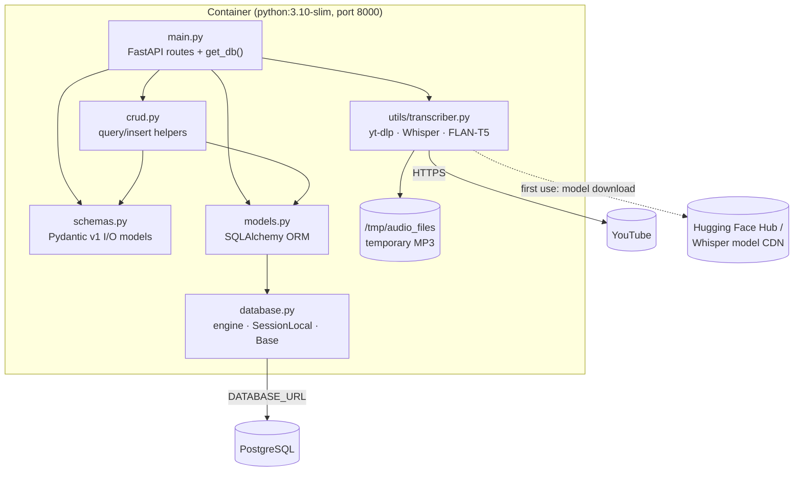
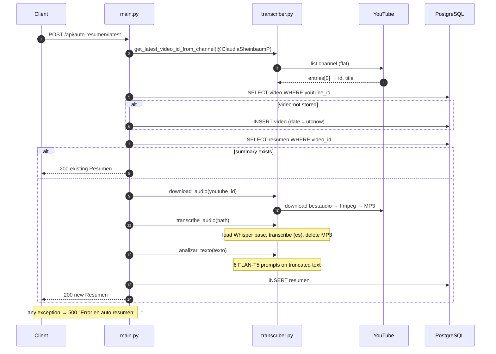
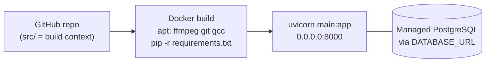

# Architecture

A deliberately simple, single-process monolith: one FastAPI application, one PostgreSQL database and in-process ML models. This page describes only what exists in [`src/`](../src/).

[← Back to README](../README.md)

---

## 1. Components

| Component | Responsibility |
|-----------|----------------|
| `main.py` | HTTP layer and orchestration. It creates tables at import time, defines the per-request DB session dependency, and implements the two auto-summary flows inline. |
| `crud.py` | Thin data-access helpers for `Video` and `Resumen`. |
| `schemas.py` | Request and response contracts (Pydantic 1, `orm_mode`). |
| `models.py` | Table definitions and the `Video` ↔ `Resumen` relationship. |
| `database.py` | Builds the SQLAlchemy engine from `DATABASE_URL`. |
| `utils/transcriber.py` | All external I/O besides the DB: YouTube listing and download, Whisper speech-to-text, FLAN-T5 analysis. |

Some endpoints in `main.py` query the database directly (`db.query(models.Video)…`) instead of going through `crud.py`, so the layering is informal.

## 2. Request flow — `POST /api/auto-resumen/latest`

`POST /api/videos/{video_id}/auto-resumen` follows the same pipeline for an already registered video. It does **not** check for an existing summary first.

## 3. Lifecycle notes

- **Import time:** `database.py` creates the engine, `main.py` runs `create_all`, and importing `utils/transcriber.py` loads the FLAN-T5 pipeline (downloading the weights on first run). The app is not ready until all of this finishes.
- **Per request:** a new DB session; for auto-summary requests, the Whisper model is loaded again on every call.
- **Concurrency:** handlers are plain `def` functions, so FastAPI runs them in its threadpool. Long transcriptions occupy a worker thread for their whole duration.

## 4. Deployment view

The commit history shows this was deployed on Railway (see [`project-context.md`](project-context.md#5-deployment-history)). After the 2026 reorganization, the build context and working directory are `src/`.

## 5. What is *not* part of the architecture

There are no queues, workers, caches, schedulers, separate ML services, authentication layers or migrations. Any of these would be a new design, not a description of this project. See [`possible-improvements.md`](possible-improvements.md).
