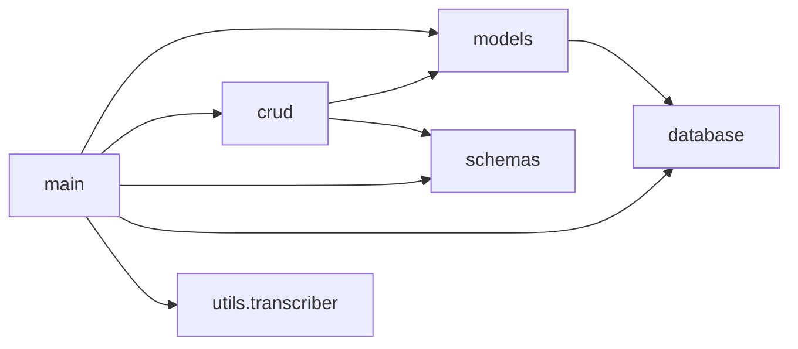

# Code Overview

A file-by-file walkthrough of the original implementation in [`src/`](../src/). The code is described as it is. Nothing here implies it was changed.

[← Back to README](../README.md)

---

## Dependency graph between modules

All imports are flat (`import models, crud, schemas`, `from database import ...`). The app therefore has to be started with `src/` as the working directory or on `PYTHONPATH`.

---

## `src/main.py` — application and endpoints

| Element | What it does |
|---------|--------------|
| `app = FastAPI()` | Application instance (`main:app`). |
| `Base.metadata.create_all(bind=engine)` | Creates the `videos` and `resumenes` tables on import if they don't exist. |
| `get_db()` | Generator dependency: opens a `SessionLocal`, yields it and closes it. |
| `home()` — `GET /` | Returns `{"message": "¡MVP Mañaneras conectado a PostgreSQL!"}`. |
| `create_video()` — `POST /api/videos` | Delegates to `crud.create_video`. |
| `read_videos()` — `GET /api/videos` | Delegates to `crud.get_videos`. |
| `create_resumen()` — `POST /api/videos/{video_id}/resumen` | Checks that the video exists (404), then `crud.create_resumen`. |
| `read_resumen()` — `GET /api/videos/{video_id}/resumen` | `crud.get_resumen_by_video`, or 404. |
| `generate_resumen_automatically()` — `POST /api/videos/{video_id}/auto-resumen` | Video lookup (404) → `download_audio` → `transcribe_audio` → `analizar_texto` → `crud.create_resumen`. Wraps everything in `try/except Exception` → 500. |
| `auto_resumen_del_ultimo_video()` — `POST /api/auto-resumen/latest` | Hard-coded `canal_url`; `get_latest_video_id_from_channel` → find or create `Video` (imports `datetime` locally) → return existing summary if present → otherwise the same pipeline as above. |

Note: in `generate_resumen_automatically` the 404 check runs *before* the `try` block, so it is returned as a 404. In `auto_resumen_del_ultimo_video` everything is inside the `try`, so any failure, including a DB error, becomes a 500.

## `src/database.py` — DB wiring

- Reads `DATABASE_URL` with `os.getenv`.
- `engine = create_engine(DATABASE_URL)`; `SessionLocal = sessionmaker(autocommit=False, autoflush=False, bind=engine)`; `Base = declarative_base()` (legacy import path `sqlalchemy.ext.declarative`).
- Comments are in Spanish ("Crear motor", "Sesiones", "Base para modelos").

## `src/models.py` — ORM models

- **`Video`** (`videos`): `id` (PK, indexed), `youtube_id` (unique, indexed), `title`, `date` (default `datetime.utcnow`), relationship `resumen` (`uselist=False`).
- **`Resumen`** (`resumenes`): `id`, `video_id` (FK → `videos.id`), `contenido` (Text) and, under the comment `# Nuevos campos`, `transcripcion_completa`, `bullet_points`, `temas_principales` (Text), plus `clasificacion_discurso`, `categoria_politica`, `sentimiento` (String). All new fields are nullable.

## `src/schemas.py` — Pydantic contracts

- `VideoBase` → `VideoCreate`, `Video` (+ `id`, `orm_mode = True`).
- `ResumenBase` (only `contenido` required; six optional `str | None` fields) → `ResumenCreate`, `Resumen` (+ `id`, `video_id`, `orm_mode = True`).
- Uses Pydantic 1 syntax (`class Config: orm_mode`), consistent with `pydantic==1.10.13`.

## `src/crud.py` — data access

| Function | Behavior |
|----------|----------|
| `get_videos(db)` | All videos, no pagination. |
| `create_video(db, video)` | `Video(**video.dict())`, then commit and refresh. |
| `get_resumen_by_video(db, video_id)` | First `Resumen` for the video. |
| `create_resumen(db, video_id, resumen_data)` | `Resumen(**resumen_data.dict(), video_id=video_id)`, then commit and refresh. |

## `src/utils/transcriber.py` — media and ML pipeline

| Element | What it does |
|---------|--------------|
| `AUDIO_DIR = "/tmp/audio_files"` | Temporary directory for downloads. |
| `class YtdlLogger` | Logger object passed to `yt-dlp`. It stores `[debug]`/`[info]`/ffmpeg/postprocessor lines, warnings and errors in `self.messages` and prints them. |
| `download_audio(youtube_id)` | Builds the watch URL, downloads `bestaudio/best` to `audio_<uuid4>.mp3` with the `FFmpegExtractAudio` (mp3) post-processor, and verifies that the file exists. On failure it raises `RuntimeError("No se pudo descargar el audio de YouTube: …")` with the collected logs. Returns the absolute path. |
| `transcribe_audio(path, model_size="base")` | `whisper.load_model(model_size)` → `model.transcribe(path, language="es")` → deletes the file → returns `result['text']`. |
| `get_latest_video_id_from_channel(channel_url)` | `yt-dlp` flat extraction; returns `(id, title)` of `entries[0]` (title defaults to `'Sin título'`). Raises if there are no entries. |
| `nlp = pipeline("text2text-generation", model="google/flan-t5-base")` | Module-level model load (comment: "Modelo multitarea en español"). |
| `analizar_texto(texto)` | Runs six prompts (see [`spec.md` §5](spec.md#5-processing-pipeline)) and returns a dict with `resumen`, `bullet_points`, `clasificacion_discurso`, `temas_principales`, `categoria_politica`, `sentimiento`. |

## `src/utils/__init__.py`

An empty file that makes `utils` a package. It was added in `2318cc6` after an import failure on deploy.

## Build and runtime files

| File | Content |
|------|---------|
| `src/requirements.txt` | `fastapi`, `uvicorn`, `sqlalchemy`, `psycopg2-binary`, `python-dotenv`, `pydantic==1.10.13`, `yt-dlp`, `ffmpeg-python`, `openai-whisper @ git+https://github.com/openai/whisper.git`, `transformers>=4.36.0`, `torch>=2.0.0`. `python-dotenv` and `ffmpeg-python` are listed but never imported. |
| `src/Dockerfile` | `python:3.10-slim`; sets `PYTHONDONTWRITEBYTECODE`/`PYTHONUNBUFFERED`; `apt-get install ffmpeg git gcc`; installs requirements; `COPY . .`; `EXPOSE 8000`; `CMD uvicorn main:app --host 0.0.0.0 --port 8000`. |
| `src/Procfile` | `web: uvicorn main:app --host 0.0.0.0 --port 8000`. |

## Coding style (preserved as-is)

- A mix of Spanish (domain names, messages, comments) and English (framework code, some comments in `YtdlLogger`).
- Synchronous handlers; broad `except Exception` blocks.
- A few emoji/inline comments (`# ✅ nuevo import`).
