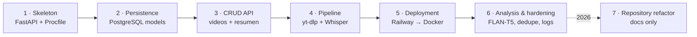

# Plan — Mañaneras Backend

> **Artifact type:** Plan (the *how* and *in what order*). **[intent](intent.md) → [spec](spec.md) → plan**.
> **Status:** Reconstructed. Phases 1–6 describe how the original implementation was actually built, mapped to the real commits from 22–24 May 2025. Phase 7 is the 2026 repository reorganization. No future work is planned. Ideas are listed separately in [`possible-improvements.md`](possible-improvements.md) and are intentionally out of scope.

[← Back to README](../README.md)

---

## Overview

Each phase lists its goal, the tasks as they appear in history, the requirements from [`spec.md`](spec.md) it delivered, and its outcome.

---

## Phase 1 — Service skeleton ✅

- **Goal:** a deployable "hello world" API.
- **Tasks:** create the FastAPI app with `GET /`; add `Procfile` (`uvicorn main:app --port 8000`); add minimal `requirements.txt`.
- **Commits:** `57afbc8` (repo, license, `.gitignore`), `6340cf8`.
- **Delivers:** FR-1 (initially "¡MVP Mañaneras está vivo!").

## Phase 2 — Persistence ✅

- **Goal:** connect to PostgreSQL and define the domain.
- **Tasks:** `database.py` (engine from `DATABASE_URL`, `SessionLocal`, `Base`); `models.py` with `Video` and `Resumen`; `create_all` at start-up; health message updated to "conectado a PostgreSQL".
- **Commits:** `e61b7b5`.
- **Delivers:** data model (spec §4, initial columns).

## Phase 3 — CRUD API ✅

- **Goal:** manual management of videos and summaries.
- **Tasks:** `schemas.py` (Pydantic, `orm_mode`); `crud.py`; `POST`/`GET /api/videos`; `POST`/`GET /api/videos/{id}/resumen` with 404 handling.
- **Commits:** `af22e79`, `0c0c948`.
- **Delivers:** FR-2 → FR-5.

## Phase 4 — Ingestion and transcription pipeline ✅

- **Goal:** go from a YouTube ID to text automatically.
- **Tasks:** `utils/transcriber.py` with `download_audio`, `transcribe_audio`, `get_latest_video_id_from_channel`; `auto-resumen` endpoints; `utils/__init__.py`.
- **Commits:** `8e2aad3`, `dd90513`, `2318cc6`.
- **Delivers:** FR-6, FR-7, FR-8 (with the transcript initially as the summary content).

## Phase 5 — Deployment stabilization ✅

- **Goal:** get the heavy dependency stack building on Railway.
- **Tasks / decisions, in order:**
  1. Install Whisper from Git (`5064a8e`).
  2. `railway.toml` forcing Python 3.10 and Pydantic 1 (`4f3b203`).
  3. Switch to the Nixpacks builder (`2012f5c`); dependency tweaks (`c3fed16`); try Python 3.12 (`9c51b5d`).
  4. **Decision:** drop `railway.toml` and build from a `Dockerfile` on `python:3.10-slim` with `ffmpeg`, `git`, `gcc` (`7c96ab6`).
- **Delivers:** spec §7 (environment and deployment contract).

## Phase 6 — Semantic analysis and hardening ✅

- **Goal:** add value beyond the raw transcript and make failures diagnosable.
- **Tasks:**
  - Return the existing summary instead of reprocessing the latest video; improve errors (`58c88a1`) → FR-7 idempotency.
  - Add the six FLAN-T5 analysis fields to the model, schemas, CRUD and endpoints (`db48f12`), plus `transformers`/`torch` (`fa30b83`) → FR-9.
  - Write audio to `/tmp/audio_files` with an absolute path and verify that it exists (`d4fefe2`).
  - Capture `yt-dlp` logs into error messages with `YtdlLogger` (`17319a1`) → FR-10.
- **Outcome:** last code change in the project. Whether downloads succeeded reliably in production afterwards is unknown.

Side event: on 23 May an automated documentation bot rewrote the README (`940f9d7`, merged as PR #1). That text is preserved in [`original/README.md`](original/README.md).

---

## Phase 7 — Repository refactor (2026) ✅

- **Goal:** make the project understandable and portfolio-ready **without changing the implementation**.
- **Guardrail:** every file under `src/` must stay byte-for-byte identical to commit `17319a1`. This is a repository refactor, not a code refactor.
- **Tasks:**
  1. Audit every file and the full git history (including the deleted `railway.toml`).
  2. Move the code, `requirements.txt`, `Procfile` and `Dockerfile` into `src/` with `git mv`. They stay together so that flat imports, `main:app` and `COPY . .` keep working.
  3. Preserve the previous README under `docs/original/`.
  4. Write the README, the intent/spec/plan artifacts, the project context, the architecture, the code overview and the improvement notes, all tagged Confirmed / Inferred / Unknown.
  5. Add `AGENTS.md` with the preservation rules for future contributors.
- **Verification:** `git diff -M main --stat` reports only renames with 0 changed lines, and checksums of all original files match before and after the move.
- **Explicitly out of scope:** fixing bugs, upgrading dependencies, adding tests/CI/linters, changing the deployment.
