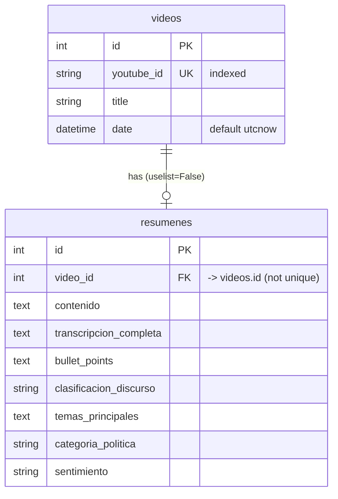

# Specification — Mañaneras Backend

> **Artifact type:** Specification (the *what*). **[intent](intent.md) → spec → [plan](plan.md)**.
> **Status:** Reconstructed from the implementation in [`src/`](../src/) as of commit `17319a1` (24 May 2025). Where the code and a requirement would differ, **the code is the source of truth**. This document describes the code; it does not prescribe changes to it.
> **Evidence tags:** **[C]** Confirmed · **[I]** Inferred · **[U]** Unknown.

[← Back to README](../README.md)

---

## 1. Scope

A single FastAPI service with seven HTTP endpoints, two database tables and one processing pipeline (YouTube audio → Whisper transcript → FLAN-T5 analysis). Intent and goals: see [`intent.md`](intent.md).

## 2. Functional requirements

Each requirement is traced to the code that implements it.

| ID | Requirement | Implementation | Level |
|----|-------------|----------------|-------|
| FR-1 | The service reports liveness and DB wiring on `GET /`. | `main.home` | C |
| FR-2 | A client can register a video with `youtube_id`, `title`, `date`. | `POST /api/videos` → `crud.create_video` | C |
| FR-3 | A client can list all registered videos. | `GET /api/videos` → `crud.get_videos` | C |
| FR-4 | A client can attach a manually written summary to an existing video; unknown video → 404. | `POST /api/videos/{video_id}/resumen` | C |
| FR-5 | A client can read a video's summary; none → 404. | `GET /api/videos/{video_id}/resumen` → `crud.get_resumen_by_video` | C |
| FR-6 | For a registered video, the system downloads its audio, transcribes it, analyzes it and stores a summary; unknown video → 404; any processing error → 500 with the message. | `POST /api/videos/{video_id}/auto-resumen` | C |
| FR-7 | The system finds the latest video of the configured channel, registers it if new, and returns the existing summary if there is one; otherwise it runs FR-6's pipeline. Errors → 500. | `POST /api/auto-resumen/latest` | C |
| FR-8 | Transcription is performed in Spanish with the Whisper `base` model, and the temporary audio file is deleted afterwards. | `utils.transcriber.transcribe_audio` | C |
| FR-9 | Analysis produces six fields: `resumen`, `bullet_points`, `clasificacion_discurso`, `temas_principales`, `categoria_politica`, `sentimiento`. | `utils.transcriber.analizar_texto` | C |
| FR-10 | Download failures include the collected `yt-dlp` log lines in the error message. | `YtdlLogger`, `download_audio` | C |

## 3. API contract

Base path: service root. All bodies are JSON. FastAPI generates OpenAPI at `/openapi.json` and interactive docs at `/docs` (framework defaults, not customized) **[C]**.

### 3.1 `Video`

```jsonc
// VideoCreate (request)
{ "youtube_id": "string", "title": "string", "date": "datetime (ISO 8601)" }
// Video (response)
{ "id": 1, "youtube_id": "string", "title": "string", "date": "datetime" }
```

### 3.2 `Resumen`

```jsonc
// ResumenCreate (request) — only "contenido" is required
{
  "contenido": "string",
  "transcripcion_completa": "string | null",
  "bullet_points": "string | null",
  "clasificacion_discurso": "string | null",
  "temas_principales": "string | null",
  "categoria_politica": "string | null",
  "sentimiento": "string | null"
}
// Resumen (response) = ResumenCreate + { "id": int, "video_id": int }
```

### 3.3 Endpoints

| Method | Path | Request | 200 response | Errors |
|--------|------|---------|--------------|--------|
| GET | `/` | — | `{"message": "¡MVP Mañaneras conectado a PostgreSQL!"}` | — |
| POST | `/api/videos` | `VideoCreate` | `Video` | DB errors propagate (e.g. duplicate `youtube_id`) → 500 by default |
| GET | `/api/videos` | — | `Video[]` | — |
| POST | `/api/videos/{video_id}/resumen` | `ResumenCreate` | `Resumen` | 404 `Video no encontrado` |
| GET | `/api/videos/{video_id}/resumen` | — | `Resumen` | 404 `Resumen no encontrado` |
| POST | `/api/videos/{video_id}/auto-resumen` | — | `Resumen` | 404 `Video no encontrado`; 500 `Error al generar resumen: …` |
| POST | `/api/auto-resumen/latest` | — | `Resumen` | 500 `Error en auto resumen: …` |

## 4. Data model



- Tables are created at application start-up with `Base.metadata.create_all` **[C]**. There are no migrations **[C]**.
- The ORM relationship is one-to-one (`uselist=False`), but the database does not enforce uniqueness of `resumenes.video_id` **[C]**.

## 5. Processing pipeline

| Step | Tool | Parameters | Level |
|------|------|------------|-------|
| Find latest video | `yt-dlp` `extract_info` | `extract_flat='in_playlist'`, `force_generic_extractor=True`, first entry of `entries` | C |
| Download audio | `yt-dlp` | `format='bestaudio/best'`, FFmpeg → MP3, output `/tmp/audio_files/audio_<uuid4>.mp3` | C |
| Transcribe | `whisper.load_model("base")` | `language="es"`; the model is loaded on every call | C |
| Analyze | `transformers.pipeline("text2text-generation", "google/flan-t5-base")` | Loaded once at import time; 6 prompts over truncated text | C |

Analysis prompts (input truncation / `max_length`):

| Output field | Prompt (Spanish, abbreviated) | Input chars | max_length |
|--------------|-------------------------------|-------------|------------|
| `resumen` | "Resume en español el siguiente texto" | 4000 | 300 |
| `bullet_points` | "Extrae los puntos principales en formato bullet en español" | 4000 | 300 |
| `clasificacion_discurso` | "¿Qué tipo de discurso es este texto? Responde con una sola palabra" | 1000 | 10 |
| `temas_principales` | "Lista los temas o palabras clave mencionadas" | 3000 | 200 |
| `categoria_politica` | "¿A qué categoría política pertenece…? (social, salud, economía, educación, etc)" | 1000 | 20 |
| `sentimiento` | "Analiza el sentimiento del texto (positivo, negativo, neutral)" | 1000 | 10 |

So only the first 1,000–4,000 characters of the transcript are analyzed. The full transcript is stored, though **[C]**.

## 6. Non-functional characteristics (observed, not designed targets)

| Aspect | Observed behavior | Level |
|--------|-------------------|-------|
| Latency | The full pipeline runs synchronously in the request; for a multi-hour video, expect many minutes on CPU | I |
| Resources | PyTorch, Whisper and FLAN-T5 in one process; the image and memory footprint are large | I |
| Security | No authentication; error details are returned to the client | C |
| Configuration | Only `DATABASE_URL`; the channel URL and model names are hard-coded | C |
| Observability | `print` statements from `YtdlLogger`; no structured logging | C |
| Portability | `str \| None` and `list[...]` annotations need Python ≥ 3.10 | C |

## 7. Environment and deployment contract

| Item | Value | Source |
|------|-------|--------|
| Python | 3.10 | `src/Dockerfile` |
| System packages | `ffmpeg`, `git`, `gcc` | `src/Dockerfile` |
| Python packages | `src/requirements.txt` (Pydantic pinned to `1.10.13`, Whisper from GitHub, `transformers>=4.36.0`, `torch>=2.0.0`, others unpinned) | C |
| Env vars | `DATABASE_URL` (required) | `src/database.py` |
| Port | 8000 | `src/Dockerfile`, `src/Procfile` |
| Entrypoint | `uvicorn main:app` from the directory containing `main.py` (`src/`) | C |

## 8. Acceptance checks (derived)

These describe how the MVP behavior *could* be verified. No tests exist in the repository.

1. `GET /` → 200 with the message in FR-1.
2. `POST /api/videos` followed by `GET /api/videos` → the new video is listed.
3. `GET /api/videos/999/resumen` for a non-existent summary → 404.
4. `POST /api/auto-resumen/latest` twice → the second call returns the same `id` without reprocessing.
